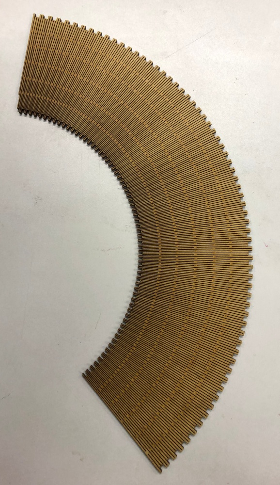

# Conical box maker
This is an inkscape extension which will create a "flex" structure with a conical form suitable for laser cut.

##Installation

In order to install this inkscape extension, copy the two files in your inkscape extensions directory.
- For Linux, this could be ~/.config/inkscape/extensions if you want to keep this extension personal, or /usr/share/inkscape/extensions if you would like to make it available to all users on your computer.
- For Windows,this is usually C:\Program Files\Inkscape\share\extensions but this could change if inkscape is installed elsewhere. On my windows computer, it is C:\Programmes\Inkscape\share\extensions

Then launch inkscape, and on the menu "extensions" a sub-menu entry Fablab should be present. In this entry, you should finf "conical box maker".

##Usage
Launch Extensions/FabLab/Conical box maker.
The following dialog box should appear :
 
You should only use mm as unit, other possibilities are NOT tested.
Material thickness is to be choosen, beware result is good only with thin material (3mm, 5mm max). I have used both MDF and plywood, results are better with MDF.
The 2 following entries are used to set up upper and lower diameters. The small circle must have a lower diameter than the larger one. The min difference betwwen diameters is 0.2mm, with a difference as low as 0.2 mm, the cone will be a cylinder !
The height of the cone is the real height, not the length of the edge, see next drawing.

 

A picture of the result 
 
##Conclusion
I hope that this inkscape extension could be useful and will help you in your designs.

FOr the flex pattern, I have used https://www.instructables.com/id/Generating-elliptical-boxes-using-a-laser-cutter-a/, thanks o lot for sharing !
